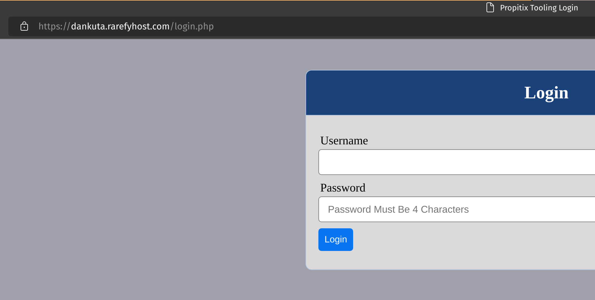

# Project 10 - Load Balancer Solution With Nginx and SSL/TLS

*Alternative & Extension of [Project 8](https://github.com/mrdankuta/pbl-project-8)*

---

## Step 1 - Setup NGINX Load Balancer Server & Connect Domain Name

- In EC2 launch new Ubuntu server named `nginx-lb`
- Open TCP port 80 for HTTP access and port 443 for HTTPS access
- Create Elastic IP in EC2 and associate new IP to `nginx-lb` server to have a static IP address.
    
    
    
    *Note that Elastic IP is free only when it is being allocated to an EC2 Instance, so do not forget to release Elastic IP once you terminate your EC2 Instance.*
- Provide a Fully Qualified Domain Name (FQDN) by registering a domain or creating a subdomain with a domain you own.
- Create an `A` record that points your domain or subdomain to the static IP you created earlier.
- Install NGINX webserver software:
    ```
    sudo apt update
    sudo apt install nginx -y
    ```
- Since `ngnx-lb` will only be used as a load balancer, we can edit the default configuration file instead of using NGINX's virtual server blocks:
    ```
    sudo vi /etc/nginx/nginx.conf
    ```
- Insert the following into the http section:
    ```
    ##
    # My Load Balancer Settings
    ##
    upstream myproject {
            server <webserver1-public-ip> weight=5;
            server <webserver2-public-ip> weight=5;
            server <webserver3-public-ip> weight=5;
    }

    server {
            listen 80;
            server_name <your-domain> www.<your-domain>;
            location / {
                    proxy_pass http://myproject;
            }
    }
    ```
- Also, comment out the following line:
    ```
    #       include /etc/nginx/sites-enabled/*;
    ```
- Restart NGINX and enable to start up automatically whenever there is a reboot:
    ```
    sudo systemctl restart nginx
    sudo systemctl enable nginx
    ```
- Test that everything works by visiting your domain name in the browser.


---

## Configure SSL/TLS

- Install certbot:
    ```
    sudo snap install --classic certbot python3-certbot-nginx
    ```
- Request a certificate to be issued and installed for the domains specified in your `nginx.conf` file you edited earlier:
    ```
    sudo ln -s /snap/bin/certbot /usr/bin/certbot
    sudo certbot --nginx
    ```
- Answer the prompts till process is complete.
    
- `certbot` automatically renews certificates that are within 30 days of expiry. Check the status of this internal timer that checks twice daily:
    ```
    sudo systemctl status certbot.timer
    ```
    
- Visit `https://<your-domain>` to test that every works and is secure.
    